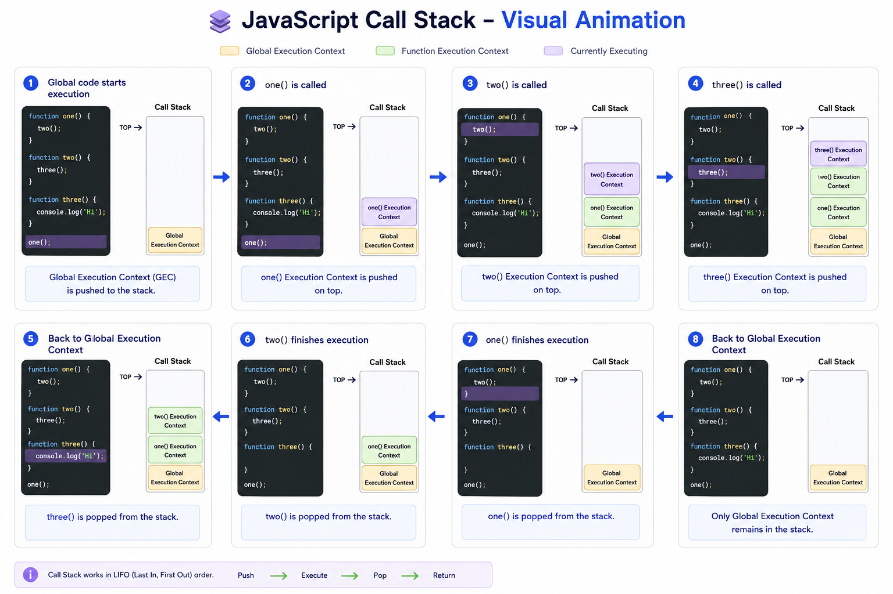

# JavaScript Day 08 — Execution Context & Call Stack Complete Visual Notes

Source Transcript: :contentReference[oaicite:0]{index=0}

---

# 1. Introduction

আজ থেকে শুরু:

```text
Module 2
```

এই module এ শেখানো হবে:

- Execution Context
- Call Stack
- Scope
- Hoisting
- Closure
- this keyword
- Objects
- Arrays
- String Methods
- Async JavaScript foundation

---

# 2. Why Day 08 Important?

Instructor বলেছেন:

```text
Execution Context is the foundation of JavaScript
```

কারণ এই concept বুঝলে সহজ হবে:

- Hoisting
- Scope
- Closure
- Event Loop
- Async JS
- this keyword

---

# 3. What is Execution Context?

Definition:

```text
Currently running code + everything needed to run it
```

সহজ ভাষায়:

```text
JavaScript এখন কোন code execute করছে
এবং execute করতে কী কী দরকার
```

---

# 4. Meaning of “Context”

Context মানে:

```text
একটি situation বা event বুঝতে প্রয়োজনীয় surrounding information
```

---

# 5. Lexical Environment

Execution Context বুঝার আগে:

```text
Lexical Environment
```

বুঝতে হবে।

---

# 6. Lexical Meaning

```text
Lexical = Related to physical placement
```

---

# 7. Lexical Environment Meaning

```text
Code physically কোথায় বসানো আছে
```

---

# 8. Example

```js
function sayName() {
  const name = "Tapas";

  console.log(name);
}
```

---

# 9. Lexical Placement

এখানে:

```text
name variable
```

lexically placed inside:

```text
sayName()
```

---

# 10. Another Example

```text
Function is inside file
Variable is inside function
```

সবকিছুর physical placement আছে।

---

# 11. Why Lexical Environment Important?

কারণ JavaScript check করে:

```text
Code grammar follow করছে কিনা
```

---

# 12. Parser Mention

আগে শেখানো হয়েছিল:

- Tokenizing
- Parsing
- AST (Abstract Syntax Tree)

---

# 13. Parser কাজ কী?

Parser:

```text
Code grammar valid কিনা check করে
```

---

# 14. Important Point

Lexical Environment শুধু placement explain করে।

Execution Context explain করে:

```text
Code execution
```

---

# 15. Global Execution Context (GEC)

যখন JavaScript file load হয়:

```text
Global Execution Context created হয়
```

Short form:

```text
GEC
```

---

# 16. Important Fact

Even if:

```text
File empty হয়
```

তবুও:

```text
GEC তৈরি হয়
```

---

# 17. Global Meaning

```text
Function এর বাইরে যা কিছু
```

---

# 18. Creation Phase

GEC এর দুইটি phase:

1. Creation Phase
2. Execution Phase

---

# 19. Creation Phase কাজ

Creation Phase এ:

- Memory allocation হয়
- Variables setup হয়
- Functions setup হয়

---

# 20. Browser Environment

Browser এ JavaScript run করলে:

```text
window object তৈরি হয়
```

---

# 21. Window Object

```js
window;
```

এতে browser related methods থাকে।

Examples:

- alert()
- prompt()
- innerHeight

---

# 22. this Keyword

Creation phase এ:

```text
this keyword ও তৈরি হয়
```

---

# 23. Important Fact

Browser environment এ:

```js
this === window;
```

---

# 24. Example

```js
console.log(this === window);
```

Output:

```text
true
```

---

# 25. Why True?

কারণ:

```text
Both point to same memory reference
```

---

# 26. Variable Creation

Example:

```js
let name = "Tom";
```

Creation phase এ:

```text
Memory allocated হয়
```

---

# 27. Initial Value

Initially variable value:

```text
undefined
```

---

# 28. undefined Meaning

```text
Variable created but value assigned হয়নি
```

---

# 29. Function Creation

Function body directly memory তে store হয়।

---

# 30. Example

```js
function sayHello() {}
```

Creation phase এ:

```text
Entire function stored in memory
```

---

# 31. Execution Phase

Creation phase শেষ হলে:

```text
Execution phase শুরু হয়
```

---

# 32. Execution Phase কাজ

```text
Line by line code execution
```

---

# 33. Example

```js
let name = "Tom";
```

Execution phase এ:

```text
undefined → "Tom"
```

---

# 34. Important Concept

Creation phase:

```text
Setup
```

Execution phase:

```text
Actual execution
```

---

# 35. Function Invocation

Function declare করলেই execute হয় না।

Execute করতে হয়:

```js
sayHello();
```

---

# 36. Function Execution Context (FEC)

যখন function call হয়:

```text
New execution context তৈরি হয়
```

এটিকে বলে:

```text
Function Execution Context
```

Short form:

```text
FEC
```

---

# 37. Important Rule

Function call না হলে:

```text
FEC তৈরি হবে না
```

---

# 38. FEC Structure

FEC এরও দুই phase থাকে:

1. Creation Phase
2. Execution Phase

---

# 39. FEC Example

```js
function tom() {
  console.log("Tom runs");
}

tom();
```

---

# 40. Step-by-Step Flow

## Step 1

GEC created

---

## Step 2

Creation phase:

- tom function stored

---

## Step 3

Execution phase:

```js
tom();
```

found

---

## Step 4

FEC created for tom()

---

## Step 5

tom function executes

---

# 41. Nested Function Execution

Function এর ভিতরে আরেক function execute হতে পারে।

---

# 42. Example

```js
function test() {
  console.log("Hello");
}
```

---

# 43. console.log is also a function

Instructor বলেছেন:

```text
console.log is also a function call
```

---

# 44. Execution Hierarchy

```text
GEC
  ↓
FEC
  ↓
console.log FEC
```

---

# 45. Important Understanding

Each function execution creates:

```text
New execution context
```

---

# 46. Complex Example

```js
let a = 5;

function testMe() {
  console.log("Inside");

  let b = 10;

  const user = {
    name: "Tapas",
  };

  function testAgain() {
    console.log("Again");
  }

  testAgain();
}

testMe();
```

---

# 47. GEC Creation Phase

Memory allocated for:

- a
- testMe

---

# 48. Initial State

```text
a → undefined
testMe → function body
```

---

# 49. GEC Execution Phase

```text
a becomes 5
```

---

# 50. testMe() Found

```text
FEC created for testMe
```

---

# 51. testMe Creation Phase

Memory allocated for:

- b
- user
- testAgain

---

# 52. Initial Values

```text
b → undefined
user → undefined
```

---

# 53. Execution Phase

```text
b = 10
```

---

# 54. Object Memory

Object stored in:

```text
Heap Memory
```

---

# 55. Primitive vs Non-Primitive

| Type          | Memory |
| ------------- | ------ |
| Primitive     | Stack  |
| Non-Primitive | Heap   |

---

# 56. Primitive Examples

- number
- string
- boolean

---

# 57. Non-Primitive Examples

- object
- array
- function

---

# 58. Stack Memory

```text
Stores primitive values and references
```

---

# 59. Heap Memory

```text
Stores objects/functions/arrays
```

---

# 60. Visual Example

```text
STACK
-----
a → 5

user → reference

HEAP
----
{name: "Tapas"}
```

---

# 61. Reference Meaning

Stack এ actual object থাকে না।

থাকে:

```text
Memory address/reference
```

---

# 62. Function Memory

Function body stored in:

```text
Heap
```

---

# 63. Stack Behavior

Stack হলো:

```text
LIFO
```

Meaning:

```text
Last In First Out
```

---

# 64. Call Stack

Execution contexts stack আকারে manage হয়।

---

# 65. Example Flow

```text
GEC
↓
testMe
↓
testAgain
```

---

# 66. Stack Diagram

```text
| testAgain |
| testMe    |
| GEC       |
```

---

# 67. After testAgain Ends

```text
| testMe |
| GEC    |
```

---

# 68. After testMe Ends

```text
| GEC |
```

---

# 69. Final Stack

```text
Empty
```

---

# 70. Garbage Collection

Unused memory automatically clean হয়।

---

# 71. Garbage Collector কাজ

যদি কোনো object/function:

```text
No reference থাকে
```

তাহলে cleanup হয়।

---

# 72. Example

```text
Object exists in heap
But no variable points to it
```

→ Garbage collected

---

# 73. Important Concept

Memory leak avoid করতে:

```text
Garbage collection important
```

---

# 74. Function Pause Behavior

Function call হলে:

```text
Current execution pauses
```

---

# 75. Example

```js
testAgain();

console.log("Done");
```

প্রথমে:

```text
testAgain পুরো execute হবে
```

তারপর:

```text
Done
```

---

# 76. Why?

কারণ:

```text
Call stack synchronous
```

---

# 77. Console.log Flow

console.log এরও:

```text
নিজস্ব execution context থাকে
```

---

# 78. Execution Order

```text
Top to bottom
Inside to outside
```

---

# 79. Main Learning Summary

| Topic               | Meaning                 |
| ------------------- | ----------------------- |
| Lexical Environment | Physical placement      |
| Execution Context   | Current execution       |
| GEC                 | Global execution        |
| FEC                 | Function execution      |
| Creation Phase      | Setup memory            |
| Execution Phase     | Run code                |
| Stack               | Execution management    |
| Heap                | Object/function storage |
| Call Stack          | Context management      |
| Garbage Collection  | Cleanup unused memory   |

---

# 80. Visual Overall Flow

```text
Load JS File
↓
Create GEC
↓
Creation Phase
↓
Execution Phase
↓
Function Call
↓
Create FEC
↓
Push to Stack
↓
Execute
↓
Pop from Stack
↓
Cleanup Memory
```

---

# 81. Important Concepts Mentioned

Future topics connected with this lesson:

- Hoisting
- Scope
- Closure
- Event Loop
- Async JavaScript
- Web APIs
- Microtask Queue
- Macrotask Queue

---

# 82. Task Given

Instructor task:

1. Create GEC/FEC flow
2. Draw stack & heap diagram
3. Draw call stack diagram
4. Take screenshots
5. Create README.md
6. Share on Discord

---

# 83. Resources Mentioned

- GitHub Repository
- Discord Community
- VS Code
- Browser DevTools

---

# 84. Final Advice

Instructor বলেছেন:

```text
Execution Context properly না বুঝলে
JavaScript deeply বোঝা কঠিন
```

---

# End of Day 08 Notes

```

```


এখানে দেখানো হয়েছে JavaScript কীভাবে **Call Stack** দিয়ে কোড চালায়।

এই কোডটা ভাবুন:

```js
function one() {
  two();
}

function two() {
  three();
}

function three() {
  console.log("Hi");
}

one();
```

প্রথমে JavaScript **Global Execution Context** তৈরি করে। এরপর `one()` call হলে `one()` stack-এর উপরে যায়। `one()` এর ভিতরে `two()` call হয়, তাই `two()` উপরে যায়। তারপর `two()` এর ভিতরে `three()` call হয়, তাই `three()` সবার উপরে যায়।

Stack-এর নিয়ম হলো **LIFO — Last In, First Out**। অর্থাৎ যে function সবার শেষে ঢোকে, সে আগে বের হয়।

তাই execution শেষ হলে:

`three()` আগে বের হবে → তারপর `two()` → তারপর `one()` → শেষে শুধু Global Context থাকবে।

সহজভাবে:

```text
Push order:
Global → one() → two() → three()

Pop order:
three() → two() → one()
```

মানে JavaScript একসাথে সব function চালায় না; সে একটার ভিতরে আরেকটা function call হলে সেগুলো stack-এ জমা রাখে, আর কাজ শেষ হলে উল্টো ক্রমে সরিয়ে দেয়।
